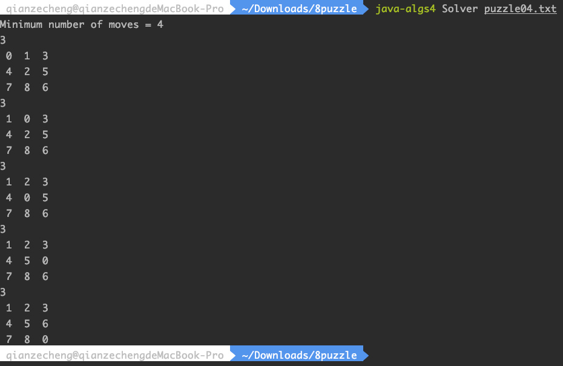

# 8-Puzzle

8 Puzzle Problem, A* Search, Priority Queue, *Manhattan priority.*

Detailed discription of the problem and related topics: [8 Puzzle](<http://coursera.cs.princeton.edu/algs4/assignments/8puzzle.html>) or [15 puzzle — Wiki](<https://en.wikipedia.org/wiki/15_puzzle>), [A* Search](<https://en.wikipedia.org/wiki/A*_search_algorithm>)

**I got 96 credits out of 100 in total for submission. I failed some timing tests.**


## Demo




The following output result shows the minimum steps to solve the puzzle.


## File

8puzzle folder:

+   Board.java
+   Solver.java


## Enviroment

**Since it's really difficult to configure environment from scratch, I strongly don't suggest configure by your own. If you have to, please refer to another repo for instructions: [Percolation](https://github.com/Aden-Q/Percolation)**


## API

Board:

```java
public class Board {
    public Board(int[][] blocks);	// construct a board from an n-by-n array of blocks (where blocks[i][j] = block in row i, col j)
    public int dimension();			// number of blocks out of place
    public int hamming();			// number of blocks out of place
    public int manhattan();			// sum of Manhattan distance between blocks and goal
    public boolean isGoal();		// is this board the goal board?
    public Board twin();			// a board that is obtained by exchanging any pair of blocks
    public boolean equals(Object y);// does this board equal y?
    public Iterable<Board> neighbors;// all neighboring boards
    public String toString();		// string representation of this board (in the output format specified)
    public static void main(String[] args)	// unit tests (not graded)
}
```


Solver:

```java
public class Solver {
    public Solver (Board initial);	// find a solution to the original board (using the A* algorithm)
    public boolean isSolvable();	// is the initial board solvable?
    public int moves();				// min number of moves to solve initial board; -1 if unsolvable
    public Iterable<Board> solution();	// sequence of boards in a shortest solution; null if unsolvable
    public static void main(String[] args);	// unit test
}
```


## Credits

Author: Zecheng Qian