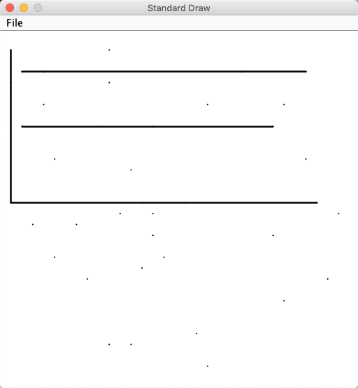
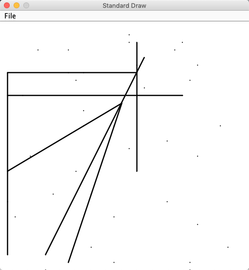
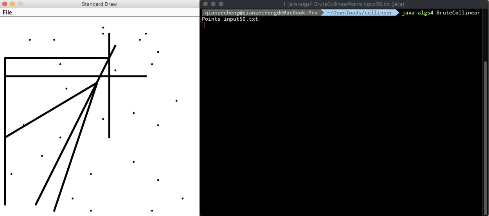
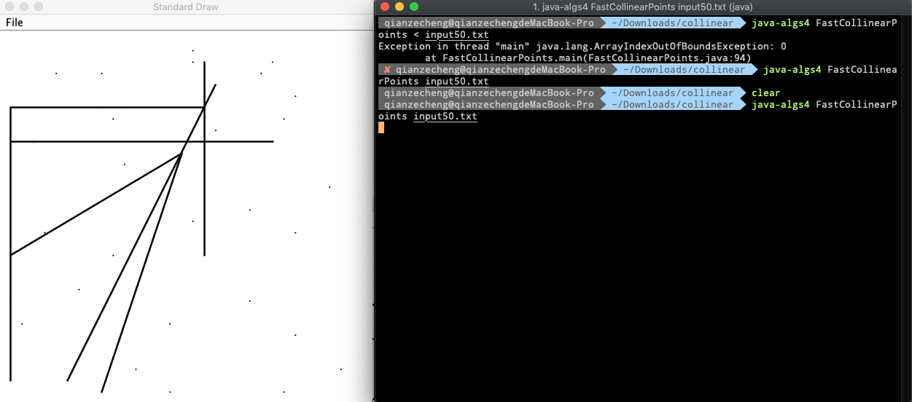

# Collinear
Pattern Recognition

Discription for details: [Pattern Recognition](<http://coursera.cs.princeton.edu/algs4/assignments/collinear.html>)

Goal: Given a set of n distinct points in the plane, find every (maximal) line segment that connects a subset of 4 or more of the points.


**Partial java classes are given by Princeton CS department, including visualizer and test files. "collinear-submit.zip" are all of my work."**

**I got 92 credits out of 100 in total for submission. I failed some timing tests because HashMap is not allowed which is useful for quick queries.**

Actually this algorithm can be implemented much faster with a hashmap but not allowed.


## Demo

40 points:



50 points:



**Black markers** represent input points, x coordinate is within range (0, 32768), y coordinate is within range (0, 32768). **Black segments** represent collinear segments with four or more collinear points.


## File

collinear folder:

+   BruteCollinearPoints.java
+   FastCollinearPoints.java
+   Points.java


## Environment

**Since it's really difficult to configure environment from scratch, I strongly don't suggest configure by your own. If you have to, please refer to another repo for instructions: [Percolation](https://github.com/Aden-Q/Percolation)**

Here are some examples showing how to run the visualizer:

BruteCollinearPoints:




FastCollinearPoints:




## API

```java
public class FastCollinearPoints {
    public FastCollinearPoints(Point[] points)	// find all line segments containing 4 or more points
    public int numberOfSegments()	// the number of line segments
    public LineSegment[] segments()	// the line segments (duplicate not allowed!)
}
```


## Credits

Author: Zecheng Qian