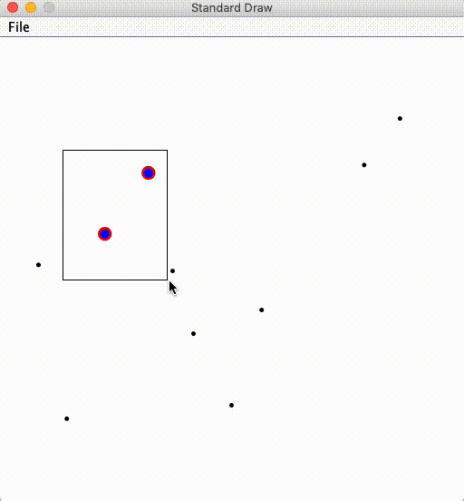
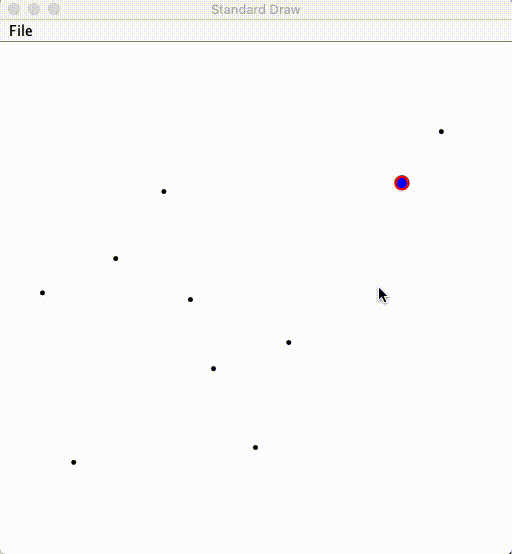

# kd-tree

**This is kd-tree data structure of java version, soon or later I will upload the python version of the same data structure. (If I can remember it.)**

Discription for details: [ Kd Tree](http://coursera.cs.princeton.edu/algs4/assignments/kdtree.html)

Goal: using a 2d-tree to support range search and nearest-neighbor search within a 2d plain.

**Partial java classes are given by Princeton CS department, including visualizer and test files. "kdtree-submit.zip" are all of my work."**

**I got 100 credits out of 100 in total for submission.**

## Demo

### Range Search



**Blue markers** represent range search results by kdtree.

**Red markers** represent range search results by TreeSet, based on Red-Black tree.

**The results show two algorithms draw the same conclusion.**


### Nearest Neighbor Search



**Blue markers** represent the nearest neighbor from the cursor point searched by kdtree.

**Red markers** represent the nearest neighbor from the cursor point searched by TreeSet, based on Red-Black tree.

**The results show that two algorithms draw the same conclusion.**


## File

kdtree folder:

+   KdTree.java
+   PointSET.java


## Environment

**Since it's really difficult to configure environment from scratch, I strongly don't suggest configure by your own. If you have to, please refer to another repo for instructions: [Percolation](https://github.com/Aden-Q/Percolation)**

How to run the visualizer:

### Range Search

The first parameter should specify the testing file for visulaization.


### Nearest Neighbor Search

Same for this visualizer, the first parameter specifies the testing file.


### API (kd tree)

```java
public class KdTree {
	public KdTree();	// constructor
	public boolean isEmpty();	// test whether the tree is empty or not
	public int size();	// number of points in the tree
	public void insert(Point2D p);	// add the point to the set(if it is not already in the 																		tree), iterative version implemented for efficiency
	public boolean contains(Point2D p);	// does the tree contains point p? iterative 
																			version implemented for efficiency
	public void draw();	// draw all points to standard draw, recursive version for 				 
											simplicity
	public Iterable<Point2D> range(RectHV rect);	// do range search within a rectangle 
																								(or on the boundary)
	public Point2D nearest(Point2D p);	// do nearest neighbor search; null if the tree is 
																			empty
}
```

For more implementation details, please refer to the source code.


## Credits

Author: Zecheng Qian