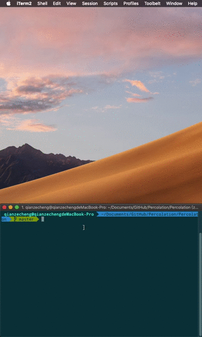
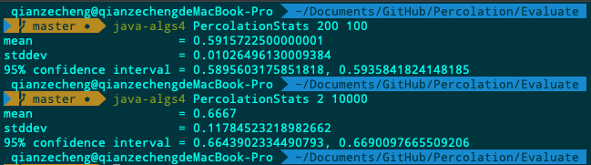
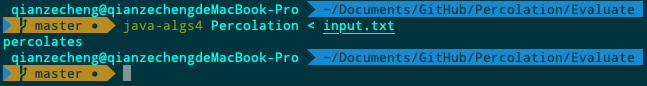
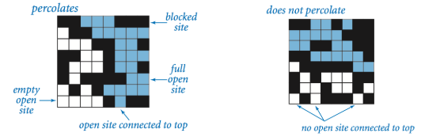
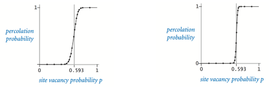
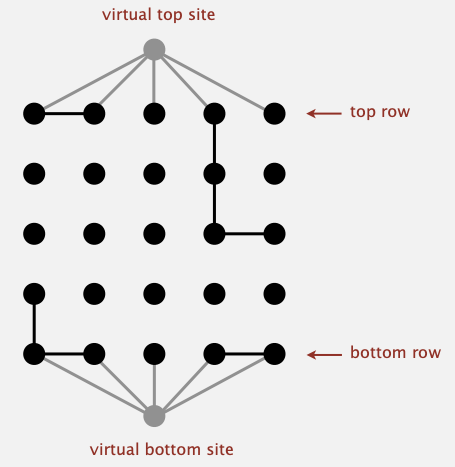
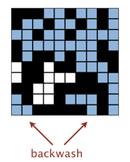
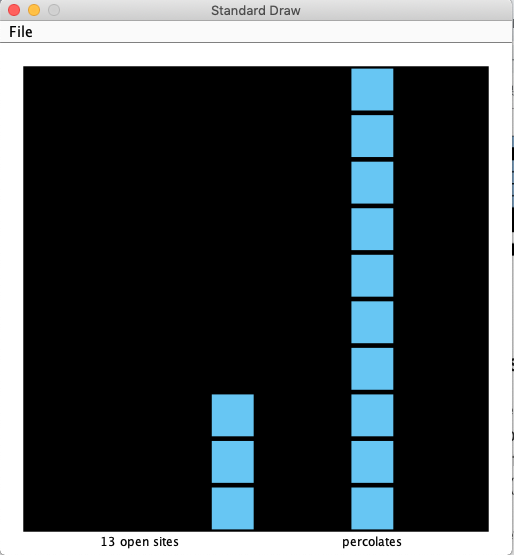
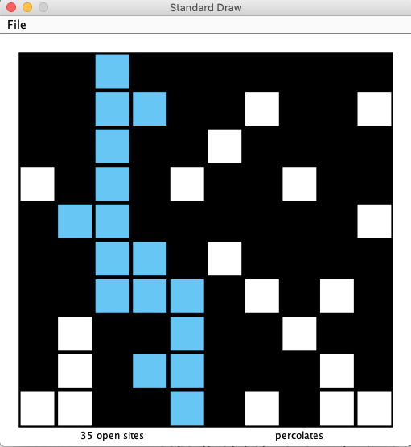

# Percolation
Percolation model. Monte Carlo simulation.

## Demo




## Environment

For Mac user, unzip algs4.zip and install algs4.app to configure running environment.

The program is to estimate the value of the percolation threshold via Monta Carlo simulation.

The 'Percolation' folder contains all files for an interactive program. To run in terminal, plz refer to 'Evaluation' folder and run the following commands:

```bash
javac-algs4 PercolationStats.java
java-algs4 PercolationStats 200 100
```

The first command line parameter specifies the **side length** of the square and the second one specifies number of trials for random experiments.

Testing results:



Or you can compile && run another file (one test case is provided):

```bash
javac-algs4 Percolation.java
java-algs4 Percolation < input.txt
```

Testing results:




## Model

The model of a percolation system is made by **n-by-n** grid of sites. Each site is either open or blocked. A site is declare as **"full site"** iff it's an open site and can be connected to an open site in the top row via a chain of neighbouring (left, right, up, down) open sites. A system percolates iff there exists a full site in the bottom row.

As shown in the figures (left percolates, right not):





## Problem

Scientific background: if sites are independently set to be open with probability p, what is the probability that system percolates?

In extreme cases, when **p** equals 0, the system does not percolate; when **p** equals 1, the system always percolates. So the program is trying the figure out the site vacancy probability **p** (threshold value).

It can be intuitively understood when n (the side length of square) is sufficiently large, then the threshold value **p** should be stable.

The tendancy of perculation can be shown as below (left 20\*20, right 100\*100)




## Algorithm

**Based on Union-Find**

### Traditional

The perculation model can be solve as a **Dynamic Connectivity** problem. A traditional way is to add two **virtual sites**, one  top site on top of the square and one bottom site below the square. In that case, the problem can be tranformed into a more general **Dynamic Connectivity** Problem. As is displayed below:



The problem of percolation is equivalence to the problem of judging wheter the **virtual top site** is connected with the **virtual bottom site**.

It seems to be an easy && efficient way to solve the problem but it will cause a problem called **"backwash"**, considering this case:



It's obvious that some sites connected with the bottom-layer sites should not be "blue" which means they should not be judge as "full site". And these wrong judgements will surely cause problem and confusion.

There are some strategies to solve this problem but either with the cost of extra time or extra space.

Actually I implement the concept using two virtual sites previously and soon I found problems with my code:



And it's either time-consuming or space-consuming to fix this problem. So I quit it and try another brand-new strategy.


### Innovative

A innovative way to solve this problem doesn't involve two virtual sites (virtual top site and virtual bottom site). And I implement it in my program.

I use a data structure like this:

```java
public class Percolation {
    private static final byte BLOCKED = 1;
    private static final byte OPEN = 2;
    private static final byte CONNECT_TO_TOP = 4;
    private static final byte CONNECT_TO_BOTTTOM = 8;

    private byte[] siteStatus;
    private int sideLength;
    private WeightedQuickUnionUF uf;
    private int numOpen;
    private boolean percolated;
}
```

I use byte array `siteStatus` to keep track of the status of each site.

Status:

+ `BLOCKED`: the site is not open
+ `OPEN`: the site is open
+ `CONNECT_TO_TOP`: the site is connected to top layer
+ `CONNECT_TO_BOTTOM`: the site is connected to bottom layer

And status priority order should be `CONNEC_TO_TOP` > `CONNECT_TO_BOTTOM` > `OPEN` (in case one site may have two confused status)

Methods:

+ `open`: if one site is blocked, then open it
+ `indexConvert`: convert row && col index to 1-D index
+ `isOpen`: judge if one site is blocked or not blocked
+ `isFull`: judge if one site is a "full site" or not
+ `percolates`: judge a system percolates or not

The only method worth saying something should be `open`, and I will just conclude some general concepts for implementation. For more detail plz refer to the code itself.

Method `open` complete two things:

+ Open a site, if the site is not on the top row or bottom row, simply set its status two be `OPEN`. If the site is on the top row, set its status `CONNECT_TO_TOP`. If the site is on the bottom row, set its statsu `CONNECT_TO_BOTTOM`
+ Connect the opened site with its neighbour (left, right, up, down). In at most 4 rounds, each round implements a `find` operation which finds the root status of the connected component and a `union` operation. After all these rounds, implement a 'fifth' `find` operation to find the root of the big connected component and combine the old status information achieved to decide the new status of the root site (how to decide is kind of hard)

The results are satisfying (no backwash problem!):




##  Postscript

The performance of the algorithm should be good, if I have time, I'll do some analysis on running time and memory usage for it.


## Credits

Author: Zecheng Qian